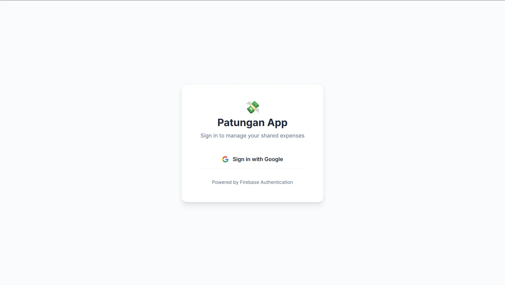
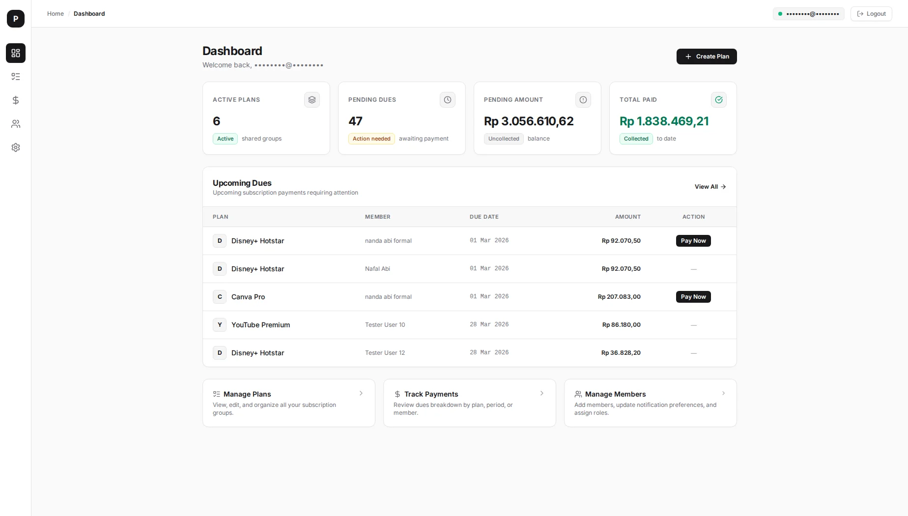
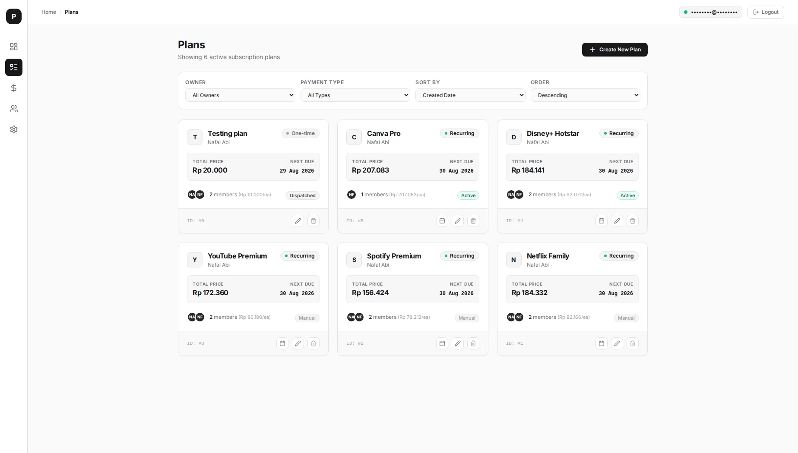
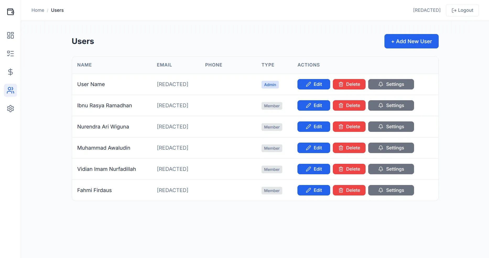
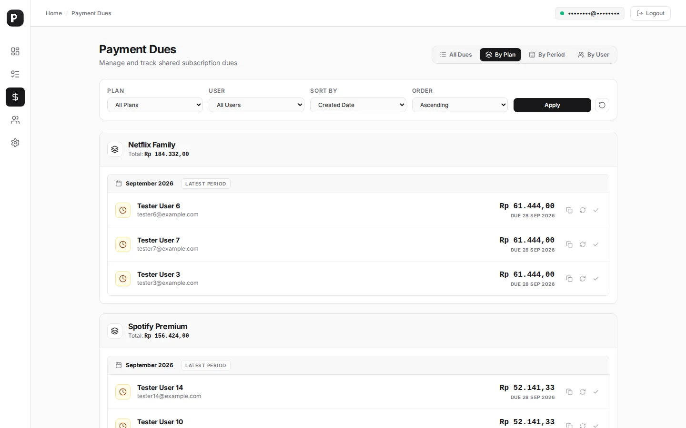
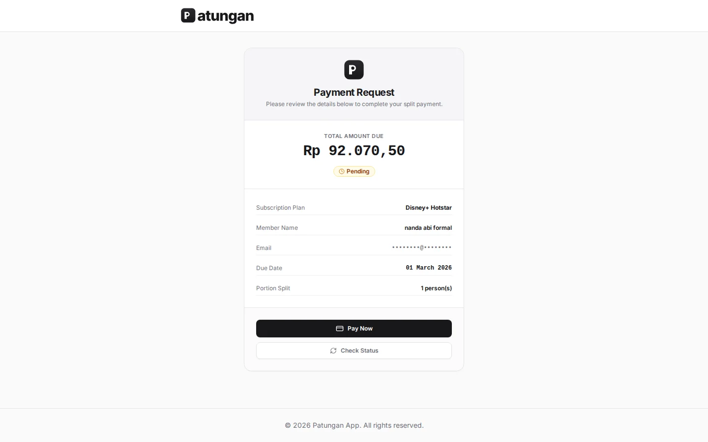
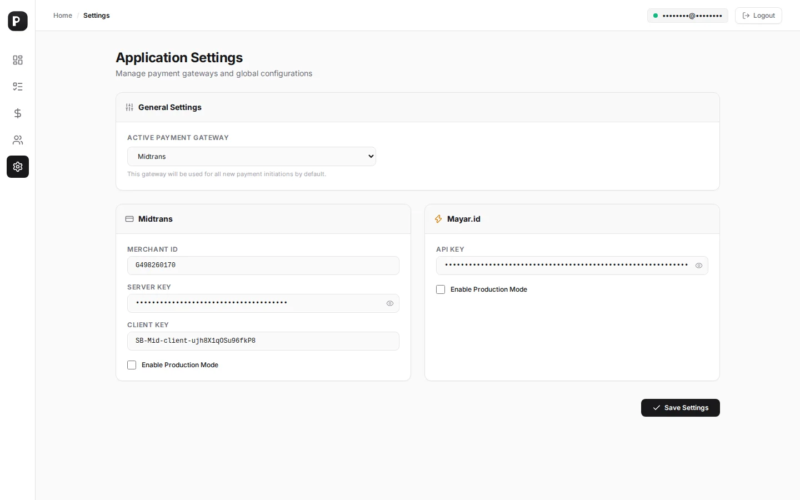

# Patungan App Showcase

This document provides a visual overview and technical description of the Patungan App interfaces.

Built using Go (Echo), Templ, HTMX, and Tailwind CSS, the application offers a server-rendered user experience with dynamic, localized updates.

---

## Table of Contents
1. [Authentication (Login)](#1-authentication-login)
2. [Dashboard](#2-dashboard)
3. [Plan Management](#3-plan-management)
4. [User Directory](#4-user-directory)
5. [Payment Dues by Plan](#5-payment-dues-by-plan)
6. [Payment Portal](#6-payment-portal)
7. [System Settings](#7-system-settings)

---

## 1. Authentication (Login)

The user entry point for authentication.

### Key Technical Aspects:
- **Firebase Authentication**: Uses the Firebase Admin SDK to handle session tokens and verification on the backend.
- **Responsive Layout**: Scales to both desktop and mobile viewports.
- **Form Validation**: Displays inline error messages and verification status upon validation failure.

---

## 2. Dashboard

The main dashboard providing an overview of active costing groups, outstanding dues, and recent system events.

### Key Technical Aspects:
- **Metrics Grid**: Card elements showing total active plans, pending dues, paid invoices, and active members.
- **Activity Log**: Displays recent transaction histories and payment status transitions.
- **Dynamic Swaps**: Stats and logs are updated asynchronously using HTMX polling features.

---

## 3. Plan Management

Allows administrators to define and organize cost-sharing plans and billing schedules.

### Key Technical Aspects:
- **Plan Cards**: Displays the group name, description, cost, recurrence interval (weekly/monthly), and active participant count.
- **Contextual Operations**: Access buttons to trigger due generation, view related bills, edit configurations, or archive plans.
- **Modal Integrations**: Uses HTMX overlays to load creation/edition forms without requiring full-page navigation.

---

## 4. User Directory

Manages user list, contact details, and account activation states.

### Key Technical Aspects:
- **Asynchronous Search**: Table content filters instantly on keypress events using `hx-trigger="keyup changed delay:300ms"`.
- **Status Indicators**: Badges display user states (Active, Pending, or Inactive).
- **Communication Fields**: Shows configured email addresses and WhatsApp contact numbers.

---

## 5. Payment Dues by Plan

Tracks payment cycles, billing items, and payment progress for specific plans.

### Key Technical Aspects:
- **Cycle Filtering**: Displays payment status organized by specific billing dates.
- **Reminders Engine**: Integrated with WAHA (WhatsApp HTTP API) to dispatch payment notices directly to user accounts or groups.
- **Manual Verification**: Admins can override payment statuses manually to record offline settlements.

---

## 6. Payment Portal

The portal interface shown to users during checkout.

### Key Technical Aspects:
- **Invoice Breakdown**: Details the base cost, service fees, taxes, and final payable sum.
- **Gateway Integration**: Directly linked with Midtrans and Mayar.id checkout processes.
- **Automatic Callbacks**: Midtrans/Mayar payment webhooks handle automated transaction verification and database updates.

---

## 7. System Settings

Administrative settings for system-wide variables and credentials.

### Key Technical Aspects:
- **Gateway Keys**: Interface to configure production and sandbox API keys for Midtrans and Mayar.id.
- **Notification Routing**: Toggle options to enable or disable notification dispatches across email, WhatsApp personal chats, or WhatsApp groups.
- **Integration Diagnostics**: Simple dashboard elements showing API and database connection states.

---

*This document was generated with the assistance of Gemini.*

